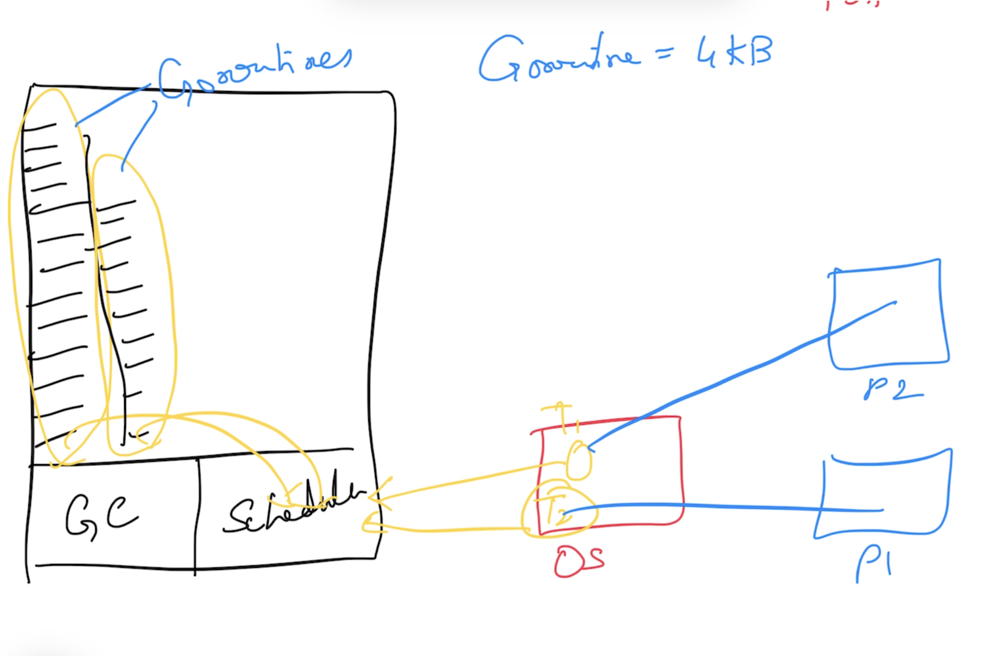
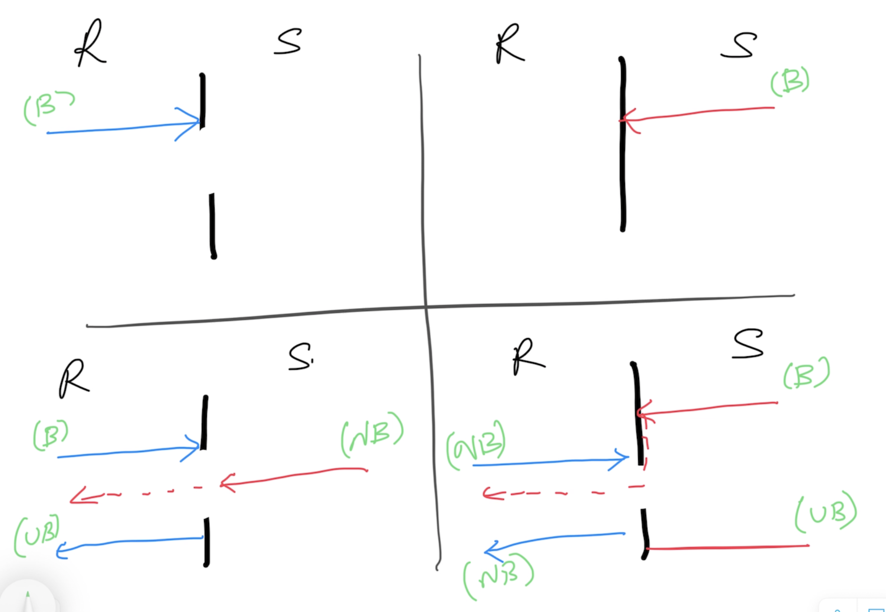

# Go Intermediate

## Magesh Kuppan
- https://linkedin.com/in/tkmagesh
- tkmagesh77@gmail.com

## Schedule
- Commence      : 9:00 AM
- Tea Break     : 10:30 AM (15 mins)
- Lunch Break   : 12:30 PM (45 mins)
- Tea Break     : 2:30 PM (15 mins)
- Wind up       : 4:00 PM

## Repo
- https://github.com/tkmagesh/nutanix-advgo-apr-2024-2

## Software Requirements
- Go Tools (https://go.dev/dl)
- Visual Studio Code
- Go extension for VSCode

## Methodology
- No powerpoints
- Code & Discuss

## Modules & Packages
### Module
- Any code that need to versioned and deployed together
- Folder with go.mod file
- go.mod (manifest file)
    - Name
        - advisable to have the complete source control path where the code is maintained
    - go runtime version
    - dependencies
- Create a module
    > go mod init [module_name]
- Create a build
    > go build .

    > go build -o [binary_name] .
- Execute a module
    > go run .
- To use a 3rd party module
    > go get [module_name]
    - downloaded to the module cache ($GOPATH$/pkg/mod/...)
- To sync the dependency references in the go.mod file
    > go mod tidy
- To compile & use a 3rd party module as a CLI
    > go install [module_name]
- To download the dependencies documented in the go.mod file
    > go mod download
- To localize the dependencies
    > go mod vendor
- Other useful commands
    > go mod graph

    > go mod why [module_name]
- Reference
    > https://go.dev/ref/mod

### Package
- Internal organization of code in a module
- Typically a folder
- Code can be scattered across multiple files in a package folder, but they all will be indentified by package name (NOT the filename)
- Public entities should be named starting with an uppercase

## Cross Compilation
- Environment Variables - [GOOS, GOARCH]
- To get the list of supported platforms
> go tool dist list
- To cross compile
> GOOS=[target_os] GOARCH=[target_arch] go build -o [binary_name] .

## Concurrency
- Supported using goroutines (~4KB)
- Builtin Scheduler
- Concurrency support built in the language itself
    - **go** keyword, **chan**nel data type, **<-** channel operator, **range** construct, **select-case** construct etc
- API support through standard library
    - sync package
    - sync/atomic package


### WaitGroup
- offered through the 'sync' package
- semaphore based counter
- capable of blocking the execution of a function until the counter becomes 0

## Channels
- Declaration
```
var [var_name] chan [data_type]
ex: 
    var ch chan int
```
- Initialization
```
[chan_var] = make(chan [data_type])
ex:
    ch = make(chan int)
```
- Channel Operator ( <- )
    - Send Operation
    ```
        ch <- [data]
    ```
    - Receive Operation
    ```
        data := <- ch
    ```
- Channel Behaviors
    - A 'RECEIVE' operation is a blocking operation unless a 'SEND' operation is already initiated
    - A 'SEND' operation is a blocking operation unless a 'RECEIVE' operation is already initiated



## Context
- Use for cancel propagation across hierarchy of goroutines
- context.Background() 
- context.WithCancel()
- context.WithTimeout()
- context.WithValue()

## GRPC
- Uses Protocol Buffers
- Meant for interoperability (albeit limited)
- Communication Patterns supported
    - Request Response
    - Server Streaming
    - Client Streaming
    - Bidirectional Streaming
- uses HTTP2
### Steps: 
    - Create service / operations / data contracts using protocol buffers
    - Share the contract between the client & server
    - Generate proxy & stub using the contracts
    - Server
        - implement the service (with the business logic) based on the contract
        - host the service
    - Client
        - Use the proxy to communicate to the service


### Tools Installation 
    1. Protocol Buffers Compiler (protoc tool)
        Windows:
            Download the file, extract and keep in a folder (PATH) accessble through the command line
            https://github.com/protocolbuffers/protobuf/releases/download/v24.4/protoc-24.4-win64.zip
        Mac:
            brew install protobuf

        Verification:
            protoc --version

    2. Go plugins (installed in the GOPATH/bin folder)
        go install google.golang.org/protobuf/cmd/protoc-gen-go@v1.28
        go install google.golang.org/grpc/cmd/protoc-gen-go-grpc@v1.2

## Testing
- gotest tool (https://github.com/rakyll/gotest)
- To generate mock objects (https://vektra.github.io/mockery/latest/)

### To generate mocks
- mockery --all

## Benchmarking
> go test -run=^$ -bench ^Benchmark_Is_Prime$ performance-app/utils -cpu 1,2,4,8 

## Profiling
> go test -run=^$ -bench ^Benchmark_Is_Prime$ performance-app/utils -cpu 1,2,4,8 -cpuprofile cpu.prof -memprofile mem.prof
> go tool pprof cpu.prof

https://paulborile.medium.com/profiling-a-golang-rest-api-server-635fa0ed45f3